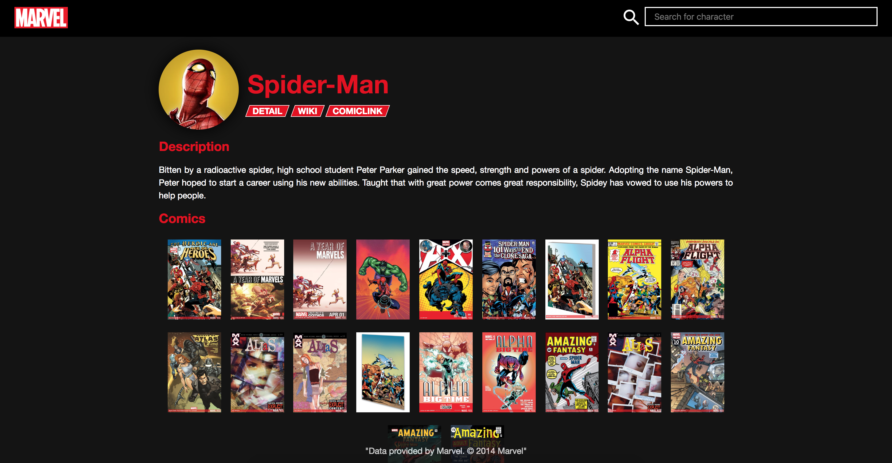
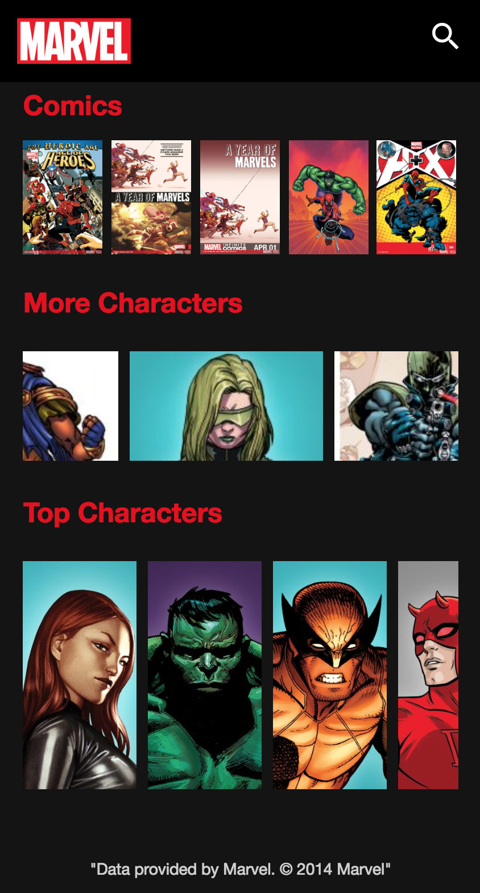

# Marvel Characters
LIVE DEMO: [Marvel Characters](https://monicargomes.github.io/marvel-character/)

Refactored version using React.js: [Marvel Characters React](https://github.com/monicargomes/marvel-characters-react)
## Summary
1. [Introduction](#introduction)  
    * [Objective](#objective)
    * [Requirements](#requirements)
3. [Architecture](#architecture) 
    * [Overview](#architecture-overview) 
    * [Characters Carousel](#characters-carousel) 
    * [Infinite Scrolling](#infinite-scrolling) 
    * [Network Interactions](#network-interactions) 
    * [Risks, caveats and limitations](#risks) 
4. [Showcase](#showcase)
4. [Conclusion](#conclusion)
5. [References and credits](#references) 
6. [Similar works](#similar-works) 

<a name="introduction" />

## Introduction
Web app that uses [Marvel Comics API](https://developer.marvel.com/) in order to display a list of characters as a carousel and to present information about a chosen character in a beautiful and responsive UI.

<a name="objective" />

### Objective
The main purpose of this repository is to exercise Software Engineering abilities through the consumption of a real world API. By the end of this work, one should be able to:
* Query a backend API that requires authentication;
* Handle RestFul error codes;
* Exercise the use of CSS, HTML and Javascript;
* Exercise the use of Media queries;
* Exercise the production of a design document;

<a name="requirements" />

### Requirements
| ID | Description |
| --- | --- |
| REQ01 | Request Marvel Comics API for a list of characters and build a carousel in pure CSS with the response |
| REQ02 | Request more characters from the API when the user scrolls until the end |
| REQ03 | Request Marvel Comics API for the details of a chosen character and display them through a clean user interface |
| REQ04 | Display the details of a random character everytime the page is refreshed |
| REQ05 | Allows the content to be adjusted based on the size of the screen (responsiveness) |
| REQ06 | Search character by name and display the ten first matches to the user input |

<a name="architecture" />

## Architecture

<a name="architecture-overview" />

### Overview
This project was built with HTML, CSS and JavaScript. A single page framework was not used for this project because of the extra complexity added by it, considering that the main purpose of this work is to lay down the foundation of frontend development (a refactored version using React.js can be found [here](https://github.com/monicargomes/marvel-characters-react)). The backend is provided by Marvel through [Marvel Comics API](https://developer.marvel.com/), there is no need to implement anything other than that to fulfill the requirements for this project. JQuery was also used in order to reduce the amount of code written, such as for Ajax requests.

<a name="characters-carousel" />

### Characters carousel
This section is inspired by Netflix's carousel of shows. There are many animations going on whenever user interacts with one of the elements of the carousel. [Eli White's article](http://eng.wealthfront.com/2015/06/30/implementing-netflix-redesign/) explains the basics of this task.

<a name="infinite-scrolling" />

### Infinite scrolling
The infinite scroll uses scrollWidth property as well as JQuery outerWidth() and scrollLeft() to verify if the user has scrolled until the end and, if so, to request more characters from the API and load them in the carousel.

<a name="network-interactions" />

### Network interactions
The only network interaction of this work happened with Marvel Comics API. The authentication to call to the Marvel Comics API involves signing up and getting a API key, then creating a timestamp for each request and a hash that should be md5 digest of the timestamp parameter, the private key and the public key. For example, a user with a public key of "1234" and a private key of "abcd" could construct a valid call as follows: `http://gateway.marvel.com/v1/public/comics?ts=1&apikey=1234&hash=ffd275c5130566a2916217b101f26150`. Every successful call will return a wrapper object, which contains metadata about the call and a container object, which displays pagination information and an array of the results returned by this call. For images, the API returns a path and an extension for each character, so it is necessary to make an extra call to the API to be able to display each image.

<a name="risks" />

### Risks, caveats and limitations
The main risks to be considerated are related to the copyrights of the images. Marvel kindly provides them for developers to use free of charge as long as they are compliant with their terms of use. Unfortunately, these restrictions do not allow caching images locally, causing the web app to seem slow once it performs a request to display the image every time. Futhermore, Marvel Comics API is limited to 3000 calls a day and since multiple requests are necessary to present all the information, there is a possibility of excending this limit in a day.

<a name="showcase" />

## Showcase

  
  
  
  

<a name="conclusion" />

## Conclusion
This project presented many challenges such as implementing the infinite scroll, turning the web app responsive and dealing with Marvel Comics API and the limit of calls. This work was a great opportunity to improve my knowledge in Frontend as it allowed me not only to practice coding but also to consider performance and UI aspects when developing a project.

<a name="references" />

## References and credits
* [Marvel Comics API](https://developer.marvel.com/)
* [Eli White's Performant CSS Animations: Netflix Case Study](http://eng.wealthfront.com/2015/06/30/implementing-netflix-redesign/)

<a name="similar-works" />

## Similar works
* [Android Marvel Characters App](https://github.com/edsilfer/marvel-characters)